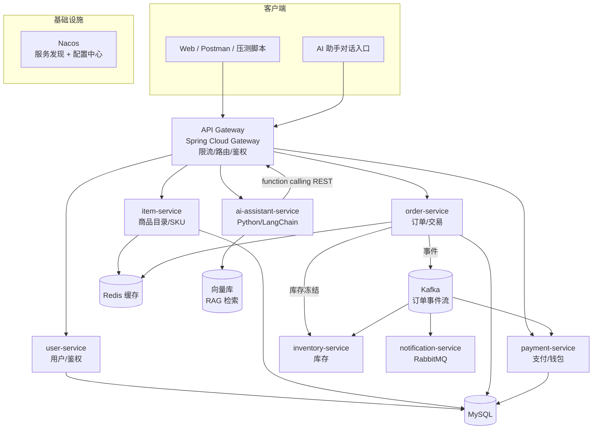

# Game Item Trading Platform — 产品开发计划（PM 视角 v1）

> 定位：一个面向游戏虚拟物品（皮肤、道具、账号、点卡等）的 **分布式 C2C/B2C 交易平台**，
> 具备 **AI 交易助手**。用一句话概括：**"游戏道具版的闲鱼 + 一个会帮你查价/砍价/下单的 AI 客服"**。

本文档是整个项目的"北极星"。后续所有架构设计、微服务拆分、里程碑都以此为准。

---

## 0. 先理解"为什么"——这个项目要证明什么

简历里的 4 条 bullet，本质上是在向面试官证明 4 种能力。产品计划必须让每条 bullet 都"有代码可查"：

| Bullet | 关键词 | 产品/技术必须落地的东西 |
|--------|--------|------------------------|
| ① 100K+ SKU 分布式平台 | Spring Cloud 微服务 + Kafka + Redis | 真实的多微服务拆分、SKU 商品体系、事件流、缓存 |
| ② LLM 交易助手 70%+ 自主解决 | LangChain + RAG + function calling | 一个能查目录/查价/下单的 AI Agent 服务 |
| ③ 500 QPS / 99.9% 可用 | 网关调优 + K8s 负载均衡 + 事件驱动订单 | 压测脚本、网关限流、异步下单链路、可用性指标 |
| ④ 发布 30min→5min | AWS ECS + Docker + Jenkins CI/CD | Dockerfile、流水线、部署编排 |

> **原则**：我们不做"玩具 Demo"，而是做一个**能自圆其说、能被追问细节**的项目。每个数字都要有对应的实现或压测证据。

---

## 1. 产品愿景与目标

### 1.1 愿景
让玩家能够**安全、快速、透明**地买卖游戏虚拟物品，并通过 AI 助手把"查价—比价—下单—售后"的链路从"人工客服 + 手动翻页"压缩成"一句话搞定"。

### 1.2 业务目标（可量化，用于对齐简历）
- **规模**：支撑 100K+ 商品 SKU、10 万级用户。
- **性能**：核心交易链路峰值 **500 QPS**，P99 延迟 < 200ms。
- **可用性**：**99.9%**（月度停机 < 43 分钟）。
- **AI 效率**：AI 助手自主解决 **70%+** 的目录查询与定价类咨询，无需转人工。
- **交付效率**：发布周期 **< 5 分钟**。

---

## 2. 目标用户与核心场景

### 2.1 用户角色
| 角色 | 诉求 | 核心功能 |
|------|------|---------|
| 买家 Buyer | 快速找到心仪道具、放心付款 | 搜索/筛选、下单、支付、担保交易 |
| 卖家 Seller | 快速上架、及时收款 | 发布商品、库存管理、订单履约、提现 |
| 平台运营 Admin | 管控风险、掌握数据 | 商品审核、订单监控、数据看板 |
| AI 助手（虚拟角色）| 替用户完成查询/下单 | 目录问答、比价、代下单、售后引导 |

### 2.2 黄金链路（Happy Path）
```
浏览/搜索商品 → 加购/直接下单 → 冻结库存 → 支付 → 担保交易(卖家发货/系统交割) → 确认收货 → 结算给卖家 → 评价
```

### 2.3 AI 助手典型对话
- "帮我找 500 元以内的 CS2 刀皮肤" → 检索目录 + 返回列表
- "这把刀现在什么价位合理？" → RAG 检索历史成交 + 定价建议
- "帮我下单第 2 个" → function calling 调用下单接口
- "我的订单到哪了？" → 查询订单状态

---

## 3. 核心功能模块（产品功能清单）

### P0（MVP 必做，支撑 Bullet ①③④）
1. **用户与鉴权**：注册/登录、JWT、角色权限。
2. **商品目录**：商品发布、SKU 体系、分类、搜索/筛选、详情。
3. **库存管理**：库存冻结/扣减/回滚（防超卖）。
4. **交易/订单**：下单、订单状态机、Kafka 事件驱动履约。
5. **支付/钱包**：模拟支付、余额账户、担保资金流。
6. **网关与限流**：统一入口、路由、限流熔断。

### P1（AI 与体验，支撑 Bullet ②）
7. **AI 交易助手**：目录问答、定价咨询、代下单（LangChain + RAG + function calling）。
8. **通知**：站内信/异步通知（RabbitMQ）。
9. **搜索增强**：热门/推荐、缓存优化。

### P2（运营与增强，可选）
10. 评价与信用体系、后台运营看板、风控。

---

## 4. 系统架构总览



### 4.1 架构分层说明（meaning → composition）
- **网关层**：所有流量入口，负责路由、鉴权、限流熔断 → 支撑"网关调优 / 500 QPS"。
- **业务微服务层**：按领域垂直拆分，各自独立数据库（Database per Service）。
- **异步/事件层**：Kafka 做订单核心事件流（削峰、解耦、最终一致），RabbitMQ 做通知类异步任务。
- **缓存层**：Redis 缓存热点商品、库存、限流计数、分布式锁。
- **AI 层**：独立 Python 服务，通过网关反向调用业务 API（function calling）。

---

## 5. 微服务拆分与技术映射

| 服务 | 语言/框架 | 职责 | 数据/中间件 | 对应 Bullet |
|------|-----------|------|-------------|-------------|
| `gateway` | Spring Cloud Gateway | 路由、限流、鉴权 | Redis(限流) | ①③ |
| `user-service` | Spring Boot + Hibernate | 用户、JWT 鉴权 | MySQL | ① |
| `item-service` | Spring Boot + Hibernate | 商品目录、SKU、搜索 | MySQL + Redis | ① |
| `inventory-service` | Spring Boot | 库存冻结/扣减 | MySQL + Redis(锁) | ①③ |
| `order-service` | Spring Boot | 订单状态机、事件生产 | MySQL + Kafka | ①③ |
| `payment-service` | Spring Boot | 支付、钱包、结算 | MySQL + Kafka | ① |
| `notification-service` | Spring Boot | 异步通知 | RabbitMQ | ① |
| `ai-assistant-service` | **Python** + LangChain | AI 助手、RAG、function calling | 向量库 + OpenAI | ② |

> 注册中心/配置中心用 **Nacos**（Spring Cloud Alibaba 生态，最省事）；也可换 Eureka + Spring Cloud Config。

---

## 6. 关键数据模型（核心表）

```
User(id, username, password_hash, role, balance, created_at)
Item(id, seller_id, title, category, game, price, status, created_at)      // SPU/商品
Sku(id, item_id, spec, price, stock, frozen_stock)                          // SKU/规格
Order(id, buyer_id, seller_id, sku_id, amount, status, created_at)          // 状态机
Payment(id, order_id, amount, status, channel, paid_at)
Wallet / Ledger(id, user_id, type, amount, balance_after, ref_order_id)     // 资金流水
```

**订单状态机**（Kafka 事件驱动）：
```
CREATED → STOCK_FROZEN → PAID → DELIVERING → COMPLETED
   └────────────→ CANCELLED / TIMEOUT_CLOSED（超时释放库存）
```

---

## 7. 非功能性需求（NFR）与实现手段

| NFR | 目标 | 实现手段 |
|-----|------|---------|
| 性能 | 500 QPS / P99<200ms | Redis 缓存、连接池调优、Kafka 异步下单、网关限流 |
| 可用性 | 99.9% | K8s 多副本 + 健康检查、熔断降级、幂等设计 |
| 一致性 | 不超卖、不丢单 | Redis 分布式锁 + 库存冻结、Kafka 幂等消费、本地消息表/最终一致 |
| 可观测 | 可定位故障 | 日志 + 指标（Prometheus/Grafana 可选）+ 链路追踪 |
| 安全 | 鉴权/防刷 | JWT、网关限流、参数校验 |

---

## 8. 里程碑与迭代计划（分 6 个 Sprint）

> 每个里程碑都能独立跑通并演示，避免"最后才集成"。

### 🏁 M0 — 基础骨架（脚手架）
- 父 POM、Nacos、Gateway、公共模块（统一响应/异常/JWT）。
- 交付物：网关能路由到一个 hello 服务，服务注册成功。

### 🏁 M1 — 用户 + 商品目录（支撑 ①）
- `user-service`（注册/登录/JWT）、`item-service`（发布/查询/搜索）。
- Redis 缓存热点商品；造 10 万级 SKU 测试数据。
- 交付物：能注册登录、能上架并搜索到商品。

### 🏁 M2 — 库存 + 订单 + 支付（支撑 ①③）
- `inventory-service`（Redis 锁 + 库存冻结）、`order-service`（状态机 + Kafka 事件）、`payment-service`。
- 下单 → 冻结库存 → 支付 → Kafka 事件驱动结算。
- 交付物：完整下单链路跑通，防超卖验证。

### 🏁 M3 — 异步通知 + 网关调优 + 压测（支撑 ③）
- `notification-service`（RabbitMQ）；网关限流熔断；JMeter/k6 压测到 500 QPS。
- 交付物：压测报告（QPS、P99、成功率）。

### 🏁 M4 — AI 交易助手（支撑 ②）
- `ai-assistant-service`：LangChain Agent + RAG（商品/成交知识库）+ function calling（调用下单/查询 API）。
- 交付物：对话能查目录、给定价建议、代下单；统计自主解决率。

### 🏁 M5 — 容器化 + CI/CD（支撑 ④）
- 各服务 Dockerfile、docker-compose 本地编排、K8s manifests、Jenkins/GitHub Actions 流水线。
- 交付物：一键构建部署，发布 < 5 分钟。

---

## 9. 技术选型（已锁定 ✅）

> 决策原则：**业务微服务 100% 纯 Java（Spring Cloud）**；**只有 AI 助手是独立 Python 微服务**，跑真·LangChain。
> 这样简历上的 **"LangChain"** 关键词完全真实、经得起面试官追问，同时项目仍是"以 Java 为主的分布式系统"。

| 决策点 | 已定方案 | 说明 |
|--------|---------|------|
| 语言/JDK | **Java 17** | 业务全 Java |
| 框架 | **Spring Boot 3.x + Spring Cloud 2023** | 主流新版 |
| 注册/配置中心 | **Nacos**（Spring Cloud Alibaba） | 一体化省事 |
| ORM | **Hibernate / Spring Data JPA** | 对齐简历 Hibernate |
| 网关 | **Spring Cloud Gateway** | 限流/路由 |
| 消息 | **Kafka**（订单事件流）+ **RabbitMQ**（通知） | 对齐简历 |
| 缓存/锁 | **Redis + Redisson** | 热点缓存 + 分布式锁 |
| 数据库 | **MySQL 8**（每服务独立库） | Database per Service |
| **AI 助手** | **Python + FastAPI + 真·LangChain** | 唯一的非 Java 服务，支撑简历 LangChain |
| 向量库 | **Chroma / FAISS**（本地） | 零成本 RAG |
| LLM | OpenAI 兼容接口（可 Mock） | 需你提供 Key，或先 Mock 跑通链路 |
| 部署 | 本地 docker-compose + K8s manifests | 真上 AWS ECS 需账号/成本，非必需 |

---

## 10. 关于简历 "LangChain" 的说明

- 采用方案 A：业务微服务全 Java，**AI 助手单独一个 Python 微服务用真·LangChain**。
- 因此简历原文 **"...an LLM trading assistant agent with LangChain, RAG, and function calling..."** 完全真实、可追问。
- 面试话术："平台是 Spring Cloud 多语言微服务架构，业务侧是 Java，AI 助手作为独立 Python 服务用 LangChain 编排，通过网关以 function calling 反向调用业务 API。"

## 11. 下一步

技术选型已锁定，从 **M0 脚手架** 开始落地：
1. 搭建多模块 Maven 项目骨架（父 POM + 公共模块）+ Gateway + Nacos。
2. 逐个 Sprint 实现（M1→M5），每步可运行、可演示。
